

  

  <h1 style="font-size: 3em; margin-bottom: 0;">Szymon Bogus</h1>
  <h3 style="margin-top: 0; font-weight: normal;">Robotics Engineer | 2x World Champion | Builder</h3>
  

 

## 👋 About Me
I’m a hands-on robotics builder and competitive SUMO-bot athlete from **Poland 🇵🇱**. I design, machine, and 3D-print mechanical parts, lay out custom PCBs, and write embedded C for STM32. I enjoy taking a robot from a CAD sketch to a tuned algorithm on my own electronics, testing, and iterating fast. 

I don't just build robots; I build winners. In **2024 and 2025**, my autonomous robots beat teams from over 30 countries to become **Back-to-Back World Champions**.

| 🏆 **World Champion** | 🌍 **Global Experience** | 👥 **Leader** | 🔬 **Researcher** |
|:---:|:---:|:---:|:---:|
| **2x Gold Medalist** RoboRAVE Int'l | Competed in **Australia & China** | Founder of **ROBOILO** 3 Years Active | Top 20 National **"Engineers of Future"** |

---

## 📸 Educational Channel (@szymigzzz)
I run a robotics education channel **[@szymigzzz](https://www.instagram.com/szymigzzz/)** where I share the reality of building world-class robots.
> *"I show the failures, the burnt PCBs, and the late nights—not just the trophies."*

  

---

## 🚀 Key Achievements

### 🏆 International Titles
- **🥇 World Champion** - RoboRAVE Beijing 2025 (MegaSUMO)
- **🥇 World Champion** - RoboRAVE Australia 2024 (SUMO HS)

### 🇵🇱 National Wins
- **🥇 1st Place** - XChallenge Rzeszów (SUMO HS)
- **🥇 1st Place** - RobON Krosno (SUMO)
- **🥇 1st Place** - Rumble Robots Malechowo 2025 (SUMO)
- **🥈 2nd Place** - Rumble Robots Malechowo 2024 (SUMO)

### 🔬 Research & Distinctions
- **Finalist (Top 20)** - "Engineers of the Future" (2024/2025)
  *Research on EV Battery Safety.*
- **Laureate (Top 100)** - "Engineers of the Future" (2025/2026 - Ongoing)
  *Research on Aerodynamic Downforce in Robotics.*

---

## 🔬 Research & Innovation

### 🔋 EV Battery Safety Analysis (Top 20 National Project)
*Program: "Engineers of the Future" (2024-2025)*
- **Goal:** Investigated thermal runaway in Li-ion/Li-po packs during collisions.
- **Method:** Built autonomous test vehicles equipped with accelerometers and thermal cameras to perform crash tests (4.4g impact).
- **Result:** Proved that a controlled crumple zone reduces G-force by **39%**, preventing battery damage.

### 🏎️ DownforceLab (Current Research)
*Program: "Engineers of the Future" (2025-2026)*
- **Goal:** Studying the effect of aerobic downforce (turbine-generated) on vehicle cornering speed and energy efficiency.
- **Platform:** Developing a custom "LineLeader" robot to log traction data under varying downforce loads.

---

## 🛠️ Featured Engineering Projects

### 🤖 SUMO Bot "McQueen" (World Champion)
*Solo Project | Jan 2024 – Oct 2024*
- **Role:** Full Stack Robotics (Mech, Elec, Code).
- **Tech:** STM32G431, UART LiDAR, Custom Motor Drivers.
- **Innovation:** Non-monocoque modular chassis for rapid field repairs. The robot uses a complex state machine for opponent tactic analysis.

### 🏎️ MiniSUMO "Lil Szymi"
*Solo Project | Oct 2024 – Aug 2025*
- **Stats:** Ultra-low center of gravity, 4-wheel drive, Custom Gearbox.
- **Electronics:** **4-layer PCB** (STM32F411 + DRV8251). integrated LIS3DH accelerometer and OLED UI in a tight form factor.
- **Features:** Ambient lighting and silicone-cast tires for maximum traction.

### ⚡ LineLeader (Work In Progress)
*Solo Project | Sep 2025 – Present*
- **Concept:** High-speed line follower with **active turbine downforce**.
- **Engineering:** 7:1 Gearbox (N60 motors), PCB structural chassis.
- **Goal:** To verify the "DownforceLab" research hypothesis.

---

## 💻 Tech Stack

**Hardware Design**

**Embedded Systems**

**Tools & Prototyping**

---

## 📸 Gallery

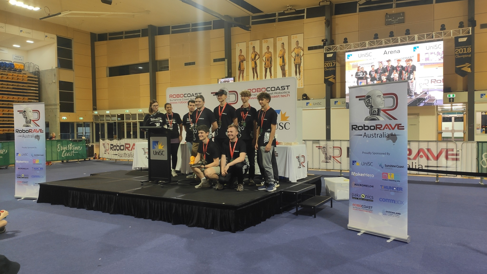
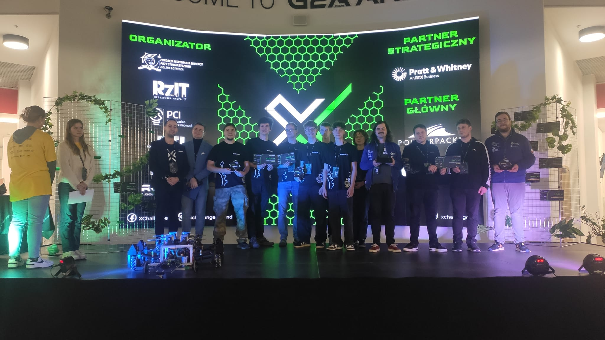
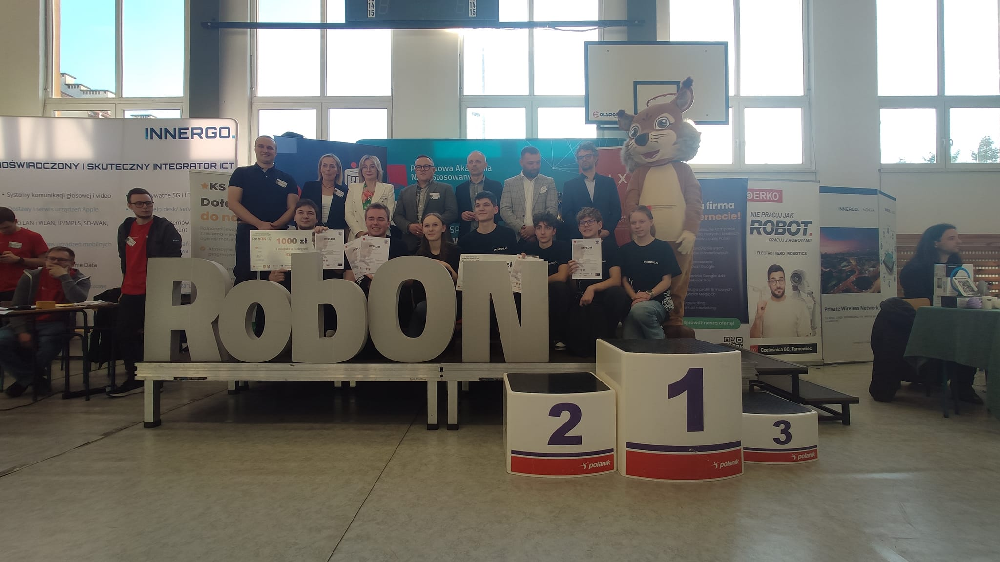
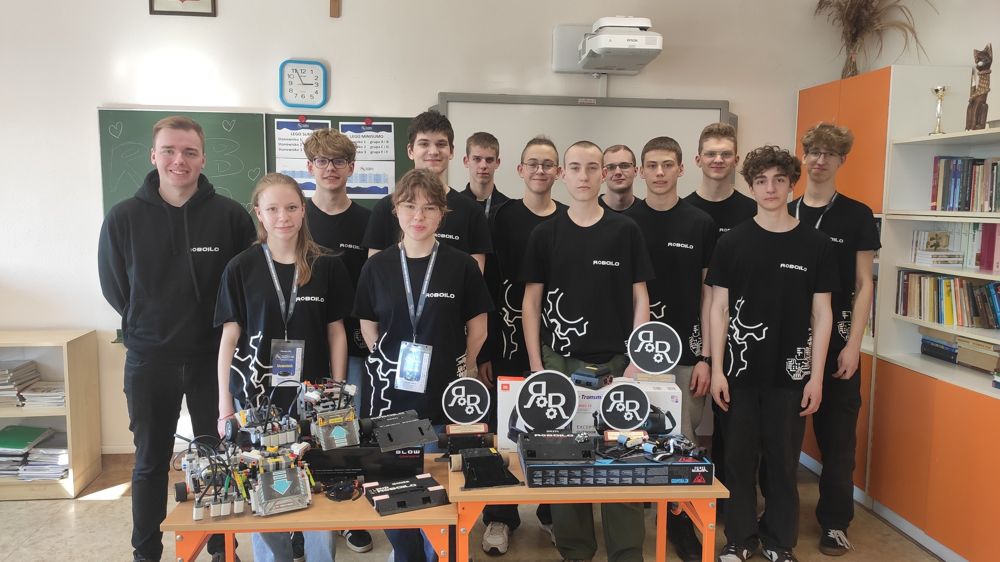
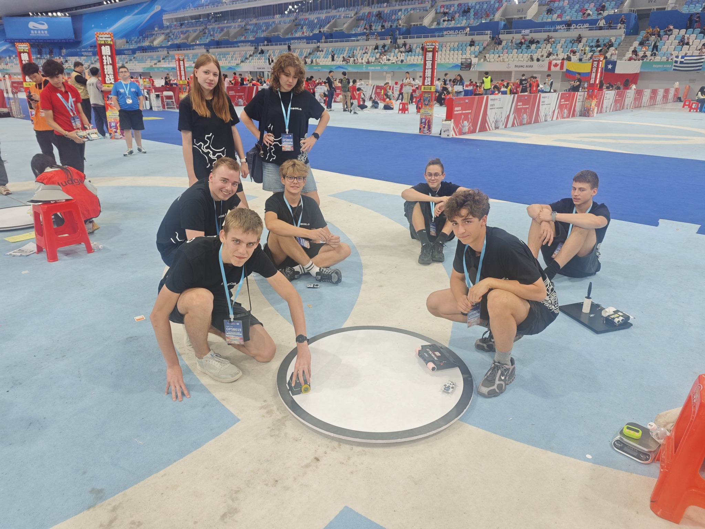
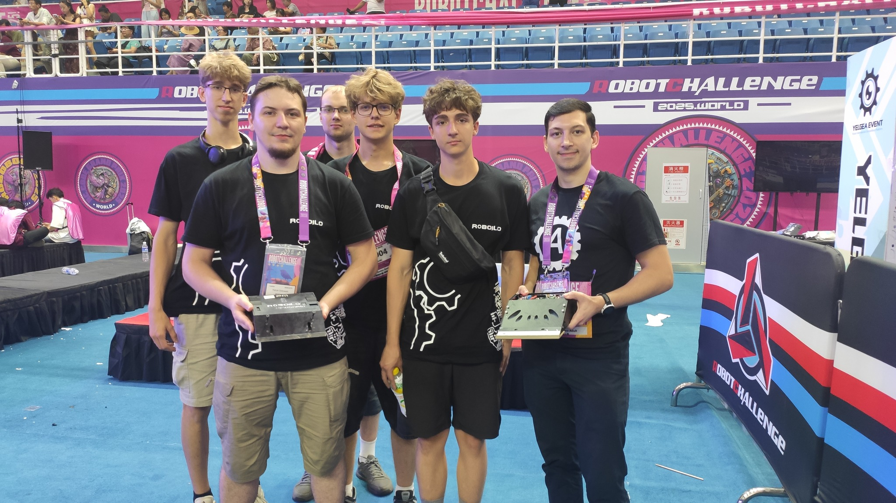
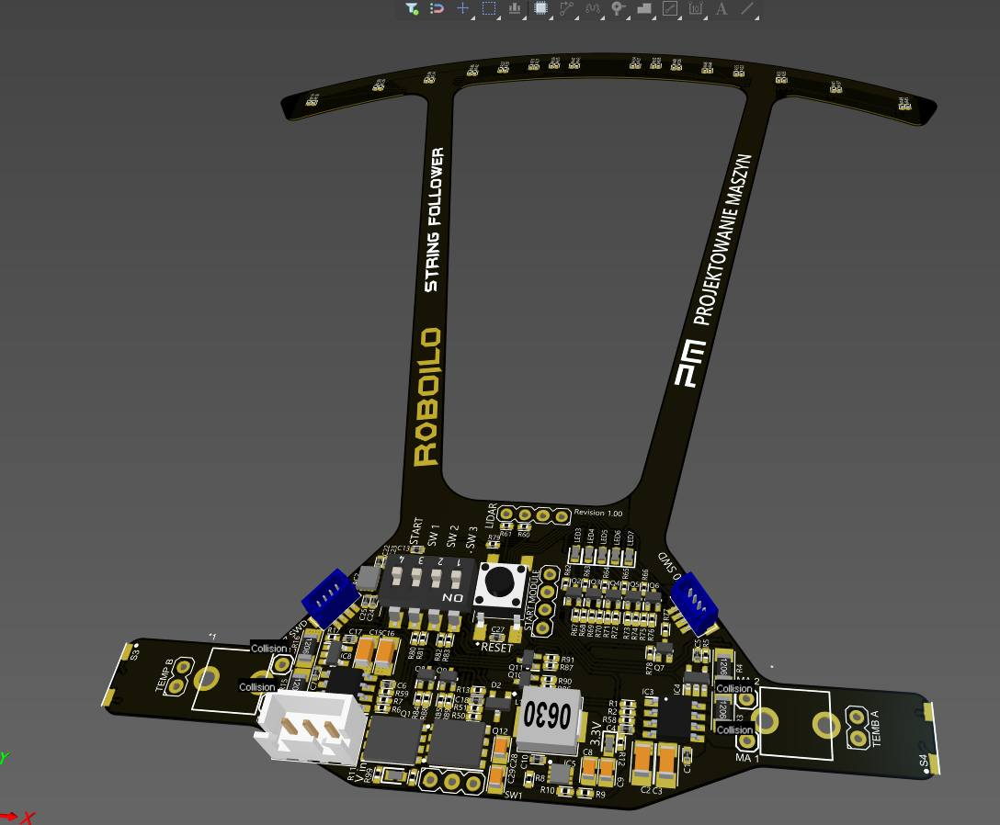
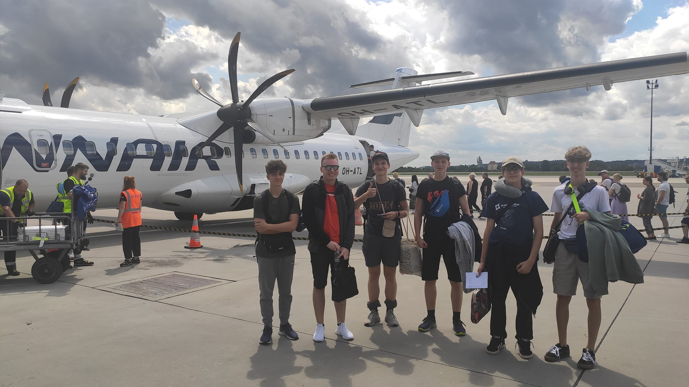

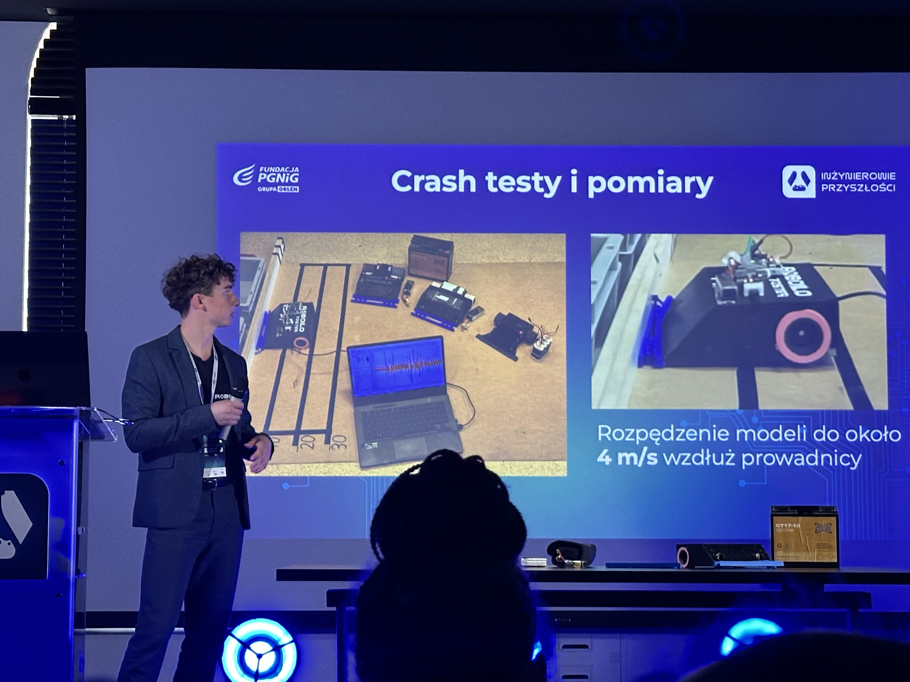

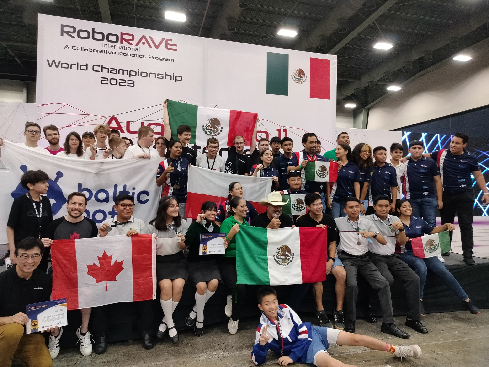
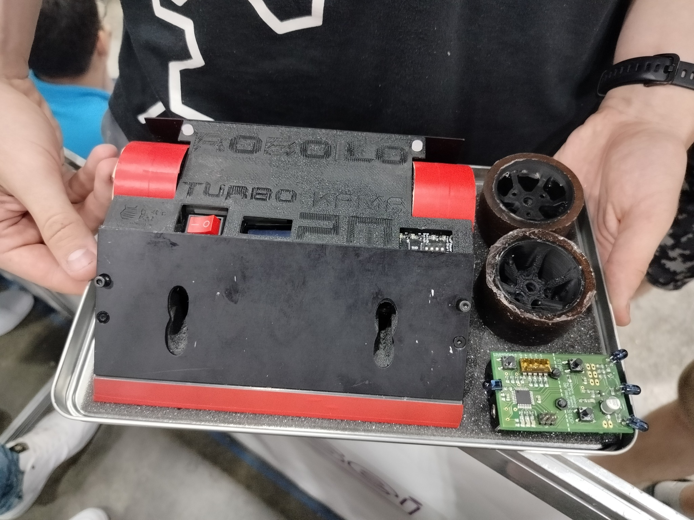

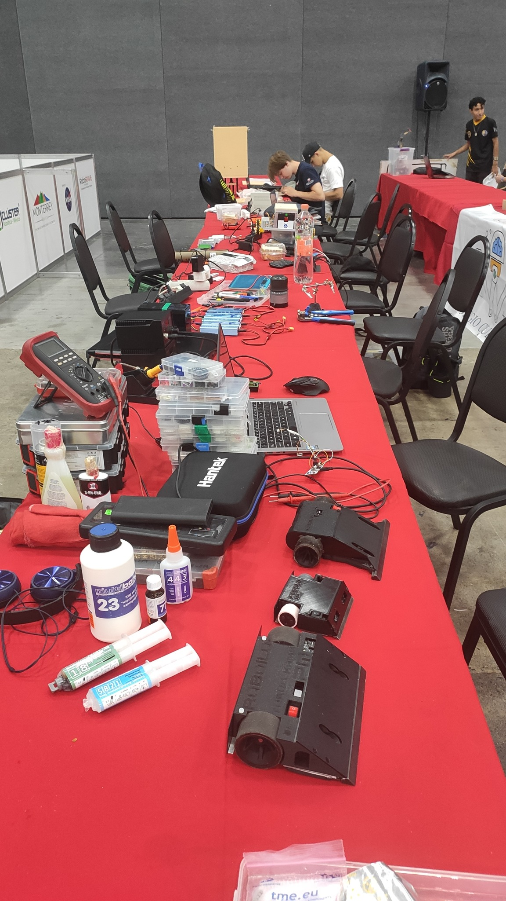

---

  <i>"I build real things that work in the real world."</i>
    
  <a href="mailto:YOUR_EMAIL"><b>Get in Touch ✉️</b></a>

