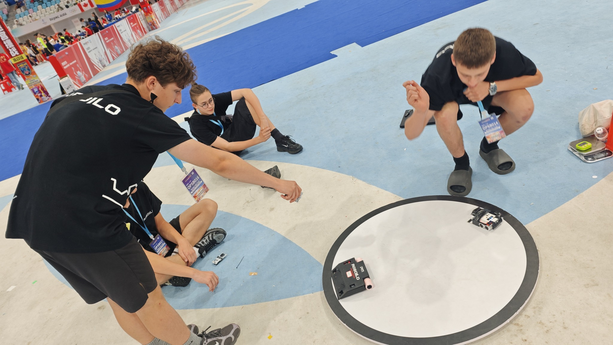
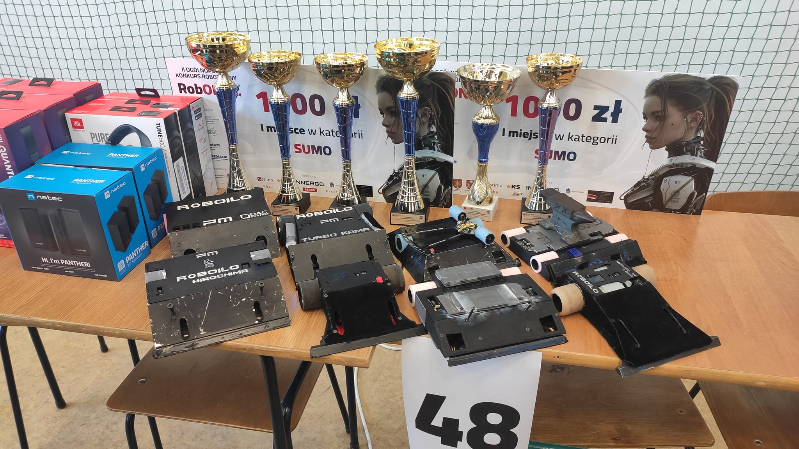

  

  <h1 style="font-size: 3em; margin-bottom: 0;">Szymon Bogus</h1>
  <h3 style="margin-top: 0; font-weight: normal;">Robotics Engineer | 2x World Champion | Builder</h3>
  
  

    
    
    
  

 

## 👋 About Me
I'm a robotics engineer from **Poland 🇵🇱** who builds autonomous systems from the ground up. My bedroom is my lab, filled with oscilloscopes, reflow ovens, and failed prototypes that taught me more than any textbook. 

I don't just build robots; I build winners. In **2024 and 2025**, my autonomous robots beat teams from over 30 countries to become **Back-to-Back World Champions**.

| 🏆 **World Champion** | 🌍 **Global Experience** | 👥 **Leader** | 🔬 **Researcher** |
|:---:|:---:|:---:|:---:|
| **2x Gold Medalist** RoboRAVE Int'l | Competed against **30+ Countries** | Founder of **ROBOILO** 20+ Members | Top 20 National **EV Battery Safety** |

---

## 🚀 Key Achievements

### 🥇 **World Champion** - RoboRAVE Beijing 2025
> *Defended the title against the best teams in the world.*
- **Role:** Lead Engineer & Builder
- **Tech:** STM32, Custom PCB, Advanced PID
- **Result:** **1st Place** (Autonomous Category)
- **Improvement:** Redesigned power systems for 20% faster response times.

### 🥇 **World Champion** - RoboRAVE Sydney 2024
> *Where it all started.*
- **Role:** Solo Builder
- **Tech:** Sensor Fusion, C, 3D Printing
- **Result:** **1st Place**
- **Feat:** Robot adapted to changing lighting conditions autonomously.

### 🔬 **Engineers of the Future (Top 20)**
- Selected for Poland's prestigious research program.
- Conducted research on **Thermal Runaway in EV Batteries**.
- Authored a technical report on protection strategies for Li-ion packs.

---

## 🛠 Projects & Engineering

<table>
  <tr>
    <td width="33%" align="center">
      
       
      <b>Competition Robot (Gen 2)</b>
       
      <i>STM32 • Custom PCB • C</i>
    </td>
    <td width="33%" align="center">
      
       
      <b>Custom Motor Drivers</b>
       
      <i>Altium Designer • High Current</i>
    </td>
    <td width="33%" align="center">
      
       
      <b>ROBOILO Club</b>
       
      <i>Teaching • Mentoring • Leadership</i>
    </td>
  </tr>
</table>

### ROBOILO Robotics Club
I founded a robotics club at my high school that grew from **0 to 20+ active members**. We started with no budget; now students design their own PCBs. I teach weekly workshops on electronics and embedded programming.

---

## 💻 Tech Stack

**Hardware Design**

**Embedded Systems**

**Tools & Prototyping**

---

  <i>"I build real things that work in the real world."</i>
    
  <a href="mailto:YOUR_EMAIL"><b>Get in Touch ✉️</b></a>

